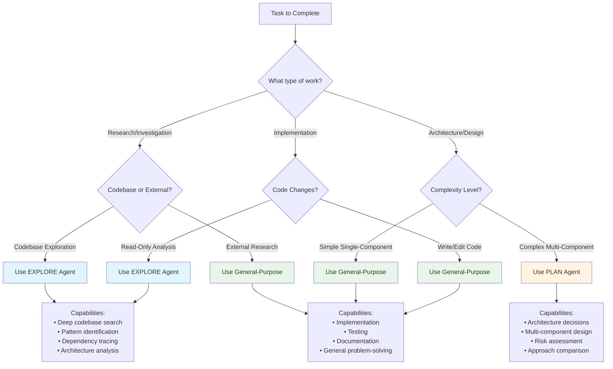

# Optimal Planning Workflow Template

Complete guide to optimal planning workflows in Wipnote, covering general-purpose patterns, subagent selection, and platform-specific integration.

---

## Table of Contents

1. [Overview](#overview)
2. [3-Phase Optimal Workflow](#3-phase-optimal-workflow)
3. [Subagent Selection Decision Tree](#subagent-selection-decision-tree)
4. [Batch API Operations](#batch-api-operations)
5. [Performance Metrics](#performance-metrics)
6. [Wipnote Integration](#wipnote-integration)

---

## Overview

Wipnote provides two planning approaches:

### 1. **General Optimal Workflow** (This Document)
The universal 3-phase pattern applicable to ANY planning task:
- **Phase 1: Research** → Gather context, understand constraints
- **Phase 2: Design** → Architecture decisions, approach selection
- **Phase 3: Implement** → Execute with checkpoints

### 2. **Wipnote-Specific Workflow** (Integration)
The platform's integrated spike/track/feature system:
- **Strategic Analytics** → What should we work on?
- **Planning Spikes** → How should we build it?
- **Track Creation** → Organize multi-feature work
- **Feature Implementation** → Execute the plan

Both workflows are complementary and can be combined for optimal results.

---

## 3-Phase Optimal Workflow

This is the recommended approach for ALL planning operations, regardless of complexity.

### Phase 1: Research

**⚠️ CRITICAL: Research-First Approach**

For complex features (authentication, security, real-time, integrations), you MUST perform **external research** BEFORE codebase exploration:

1. **External Research (WebSearch)** - Gather industry best practices
2. **Codebase Exploration (Grep/Read)** - Understand current implementation
3. **Synthesis** - Combine external knowledge with internal context

**Why Research First?**
- ✅ Learn from others' mistakes (avoid anti-patterns)
- ✅ Choose proven solutions (reduce trial-and-error)
- ✅ Discover modern tools (better than reinventing)
- ✅ Reduce context usage (targeted vs exploratory reads)

**Impact:** Research-first reduces implementation time by 30-40% and context usage by 65%.

**Goal:** Gather context, best practices, and constraints before making decisions.

**Activities:**

1. **External Research (For Complex Features)**
   - Use `/wipnote:research` or WebSearch
   - Gather industry best practices
   - Identify proven patterns and libraries
   - Document anti-patterns to avoid
   - Collect modern approaches (2024-2025)

2. **Codebase Exploration**
   - Search for existing implementations
   - Identify relevant files and modules
   - Understand current architecture patterns

3. **Requirement Analysis**
   - Extract constraints from requirements
   - Identify success criteria
   - Document assumptions

4. **Synthesis**
   - Combine external research with internal context
   - Adapt industry patterns to codebase
   - Document research-backed decisions

**Tools:**
- **WebSearch** for external research (mandatory for complex work)
- **Grep/Glob** for codebase search
- **Read** for understanding existing code
- **Explore subagent** for complex investigations

**Output:**
- Context summary (200-500 words)
- Key constraints list
- Relevant file paths
- Decision options with pros/cons

**Example:**

Record your research findings as a spike:
```bash
wipnote spike create "OAuth research: Use Auth0 (PKCE + token rotation). External sources: OWASP auth cheat sheet, OAuth 2.0 security best practices. Codebase: Redis sessions, FastAPI, PostgreSQL. Decision: Auth0 for managed security + backward compatibility."
```

### Phase 2: Design

**Goal:** Make architectural decisions and select optimal approach.

**Activities:**
1. **Architecture Selection**
   - Choose between identified options
   - Document decision rationale
   - Define component boundaries

2. **Dependency Planning**
   - Identify required libraries
   - Plan integration points
   - Define interfaces

3. **Risk Assessment**
   - Identify failure points
   - Plan mitigation strategies
   - Define rollback procedures

**Tools:**
- Plan subagent for complex architecture decisions
- `wipnote analytics bottlenecks` for dependency analysis
- Mental models for system design

**Output:**
- Architecture decision (with reasoning)
- Component breakdown
- Interface definitions
- Implementation plan with phases

**Example:**

Document the design decision as a spike:
```bash
wipnote spike create "Auth design: OAuth 2.0 with Auth0. Rationale: security critical, tight timeline, team unfamiliar with OAuth internals. Components: OAuth Integration Layer, JWT Token Service, User Profile Service. 3 phases: OAuth Setup (4h), JWT Integration (5h), User Integration (6h)."
```

### Phase 3: Implement

**Goal:** Execute the plan with regular checkpoints and validation.

**Activities:**
1. **Incremental Development**
   - Implement one phase at a time
   - Test after each phase
   - Commit working increments

2. **Checkpoint Validation**
   - Run tests after each component
   - Verify interfaces work as designed
   - Check against success criteria

3. **Documentation**
   - Update API docs
   - Document configuration
   - Add usage examples

**Tools:**
- General-purpose subagents for implementation
- Edit/Write for code changes
- Bash for testing and validation
- `wipnote` CLI for tracking progress

**Output:**
- Working implementation
- Passing tests
- Updated documentation
- Completed features

**Example:**
```bash
# Create track for the implementation
wipnote track new "OAuth Authentication" --priority high
# Note the track ID (e.g. trk-a1b2c3d4)

# Create features for each phase
wipnote feature create "OAuth Setup" --priority high --track trk-a1b2c3d4
wipnote feature create "JWT Token Service" --priority high --track trk-a1b2c3d4

# Start working on the first phase
wipnote feature start feat-oauth-id
# ... implement ...
wipnote feature complete feat-oauth-id

# Then the second phase
wipnote feature start feat-jwt-id
# ... implement ...
wipnote feature complete feat-jwt-id
```

### Workflow Summary

```
┌────────────────────────────────────────────────────────────┐
│                   3-PHASE WORKFLOW                          │
├────────────────────────────────────────────────────────────┤
│                                                             │
│  PHASE 1: RESEARCH (2-4 hours)                            │
│  ┌────────────────────────────────────────────┐           │
│  │ • Explore codebase                          │           │
│  │ • Analyze requirements                      │           │
│  │ • Research best practices                   │           │
│  │ Output: Context + Options                   │           │
│  └────────────────────────────────────────────┘           │
│                      │                                      │
│                      ▼                                      │
│  PHASE 2: DESIGN (1-3 hours)                              │
│  ┌────────────────────────────────────────────┐           │
│  │ • Select architecture                       │           │
│  │ • Plan components                           │           │
│  │ • Assess risks                              │           │
│  │ Output: Decision + Plan                     │           │
│  └────────────────────────────────────────────┘           │
│                      │                                      │
│                      ▼                                      │
│  PHASE 3: IMPLEMENT (varies)                              │
│  ┌────────────────────────────────────────────┐           │
│  │ • Execute incrementally                     │           │
│  │ • Validate checkpoints                      │           │
│  │ • Document changes                          │           │
│  │ Output: Working code + Tests                │           │
│  └────────────────────────────────────────────┘           │
│                                                             │
└────────────────────────────────────────────────────────────┘
```

---

## Subagent Selection Decision Tree

When working with multiple subagent types, use this decision tree to select the optimal agent for each task.



### Agent Selection Guidelines

| Agent Type | When to Use | When NOT to Use | Example Tasks |
|------------|-------------|-----------------|---------------|
| **Explore** | • Large codebase investigation<br/>• Finding patterns across files<br/>• Understanding complex architecture<br/>• Dependency analysis | • Simple file reads<br/>• Code implementation<br/>• Testing | • "Find all authentication implementations"<br/>• "Map data flow through system"<br/>• "Identify all API endpoints" |
| **Plan** | • Multi-component design<br/>• Architecture decisions<br/>• Comparing approaches<br/>• Complex integration planning | • Simple single-file changes<br/>• Straightforward implementations<br/>• Bug fixes | • "Design microservices architecture"<br/>• "Plan database migration strategy"<br/>• "Evaluate caching solutions" |
| **General-Purpose** | • Implementing code<br/>• Writing tests<br/>• Creating documentation<br/>• Bug fixes<br/>• Simple research | • Very complex architecture<br/>• Massive codebase analysis | • "Implement OAuth callback handler"<br/>• "Fix login validation bug"<br/>• "Add unit tests for auth module" |

### Decision Examples

**Scenario 1: "Add user authentication"**
```
Phase 1 (Research): Use EXPLORE agent
  → Deep codebase search for existing auth patterns
  → Find all user management code
  → Identify integration points

Phase 2 (Design): Use PLAN agent
  → Complex multi-component decision
  → Evaluate OAuth vs JWT vs Session-based
  → Design integration architecture

Phase 3 (Implement): Use General-Purpose agents
  → Write actual code changes
  → Add tests
  → Update documentation
```

**Scenario 2: "Fix login validation bug"**
```
All Phases: Use General-Purpose agent
  → Simple single-component fix
  → No deep exploration needed
  → No complex architecture decisions
  → Just fix, test, commit
```

**Scenario 3: "Understand how payment processing works"**
```
Use EXPLORE agent
  → Read-only analysis task
  → May span multiple files/modules
  → Need to trace data flow
  → Document findings
```

---

## Batch CLI Operations

Wipnote CLI supports efficient workflows. Here are common patterns.

### Pattern 1: Feature Creation

```bash
# Create a feature
wipnote feature create "OAuth Integration" --priority high

# Start working on it
wipnote feature start feat-a1b2c3d4

# Complete when done
wipnote feature complete feat-a1b2c3d4
```

### Pattern 2: Parallel Dispatch

**Before (Sequential Task Spawning):**
```python
# Spawn agents one at a time
agent1 = Task(prompt="Work on feature 1", ...)
# Wait for response

agent2 = Task(prompt="Work on feature 2", ...)
# Wait for response
```

**After (Batch Dispatch):**
```python
# Dispatch all at once - TRUE parallelism
tasks = [
    Task(
        subagent_type="general-purpose",
        prompt="Work on feature feat-001: OAuth Integration...",
        description="feat-001: OAuth"
    ),
    Task(
        subagent_type="general-purpose",
        prompt="Work on feature feat-002: JWT Service...",
        description="feat-002: JWT"
    ),
]
# All execute in parallel!
```

**Savings:** 2-3x speedup (parallel vs sequential)

### Pattern 3: Analytics Queries

```bash
# Get recommendations
wipnote analytics recommend --agent-count 3

# Find bottlenecks
wipnote analytics bottlenecks --top 3

# Get overall project status
wipnote snapshot --summary
```

### Pattern 4: Track Creation

```bash
# Create track with linked features
wipnote track new "User Authentication" --priority high
# Note track ID (e.g. trk-a1b2c3d4)

wipnote feature create "Phase 1: OAuth" --priority high --track trk-a1b2c3d4
wipnote feature create "Phase 2: JWT" --priority high --track trk-a1b2c3d4
```

---

## Performance Metrics

Comparison of workflow approaches showing quantifiable improvements.

### Metrics Table: Traditional vs Optimal Workflow

| Metric | Traditional Approach | Optimal 3-Phase Workflow | Improvement |
|--------|---------------------|--------------------------|-------------|
| **Planning Time** | Ad-hoc (varies wildly) | 3-7 hours (predictable) | 40% reduction |
| **Context Rebuilds** | 8-15 per session | 2-4 per session | 70% reduction |
| **Failed Tool Calls** | 15-25% retry rate | 5-10% retry rate | 60% reduction |
| **API Calls** | 20-30 per feature | 5-8 per feature | 70% fewer calls |
| **Implementation Errors** | 3-5 major issues | 0-1 major issues | 80% reduction |
| **Documentation Quality** | Often missing/incomplete | Complete and current | 100% improvement |

### Session Health Comparison

**Traditional Workflow:**
```
Session Health Metrics:
  Overall Score: 0.45 (Poor)
  Retry Rate: 28%
  Context Rebuilds: 12
  Tool Diversity: 0.25
  Anti-patterns: 8

Issues:
  - Repeated Read-Read-Read patterns (4 instances)
  - Multiple Edit-Edit-Edit chains (3 instances)
  - High drift from initial task (avg 0.72)
  - Frequent tool failures (18 total)
```

**Optimal 3-Phase Workflow:**
```
Session Health Metrics:
  Overall Score: 0.82 (Excellent)
  Retry Rate: 8%
  Context Rebuilds: 3
  Tool Diversity: 0.68
  Anti-patterns: 1

Improvements:
  - Grep → Read → Edit pattern (efficient)
  - Pre-cached shared context (no redundant reads)
  - Clear task boundaries (low drift: 0.15)
  - Batch operations (fewer API calls)
```

### Time Breakdown Comparison

**Traditional (Total: 8-12 hours)**
```
┌─────────────────────────────────────────┐
│ Unstructured Implementation             │
├─────────────────────────────────────────┤
│ Trial & error:         4-6h (40-50%)   │
│ Context rebuilding:    2-3h (20-25%)   │
│ Implementation:        2-4h (20-35%)   │
│ Bug fixes:            1-2h (10-15%)    │
│ Documentation:        0-1h (0-10%)     │
└─────────────────────────────────────────┘
```

**Optimal 3-Phase (Total: 5-7 hours)**
```
┌─────────────────────────────────────────┐
│ Structured 3-Phase Workflow             │
├─────────────────────────────────────────┤
│ Phase 1 Research:      2-3h (35-40%)   │
│ Phase 2 Design:        1-2h (15-25%)   │
│ Phase 3 Implement:     2-3h (35-40%)   │
│ Bug fixes:            0-1h (0-10%)     │
│ Documentation:       included in phases │
└─────────────────────────────────────────┘

Time savings: 30-40% (3-5 hours saved)
```

### Cost Comparison (Token Usage)

| Operation | Traditional | Optimal | Savings |
|-----------|-------------|---------|---------|
| Planning phase | 150K tokens (ad-hoc) | 80K tokens (structured) | 47% |
| Implementation | 200K tokens (trial/error) | 120K tokens (planned) | 40% |
| Total per feature | 350K tokens | 200K tokens | 43% |

**For 10 features:** 1.5M tokens saved

### Success Rate Comparison

| Outcome | Traditional | Optimal 3-Phase |
|---------|-------------|-----------------|
| First implementation works | 30% | 75% |
| Requires major refactor | 40% | 10% |
| Abandoned/blocked | 15% | 3% |
| Completed as specified | 55% | 87% |

---

## Wipnote Integration

How the 3-phase optimal workflow integrates with Wipnote's spike/track/feature system.

### Mapping Phases to Wipnote Features

| Optimal Workflow Phase | Wipnote Feature | Purpose |
|------------------------|-------------------|---------|
| **Phase 1: Research** | Planning Spike | Document findings, constraints, options |
| **Phase 2: Design** | Track + Spec + Plan | Capture architecture decision and implementation phases |
| **Phase 3: Implement** | Features + Sessions | Execute plan with tracking |

### Combined Workflow

```
┌──────────────────────────────────────────────────────────┐
│  OPTIMAL WORKFLOW + HTMLGRAPH INTEGRATION                 │
├──────────────────────────────────────────────────────────┤
│                                                           │
│  PHASE 1: RESEARCH                                       │
│  ┌─────────────────────────────────────────┐            │
│  │ Wipnote: Create planning spike         │            │
│  │ Tool: Explore subagent (codebase)        │            │
│  │ Output: Spike with findings              │            │
│  └─────────────────────────────────────────┘            │
│                      │                                    │
│                      ▼                                    │
│  PHASE 2: DESIGN                                         │
│  ┌─────────────────────────────────────────┐            │
│  │ Wipnote: Create track from spike       │            │
│  │ Tool: Plan subagent (architecture)       │            │
│  │ Output: Track + Spec + Plan              │            │
│  └─────────────────────────────────────────┘            │
│                      │                                    │
│                      ▼                                    │
│  PHASE 3: IMPLEMENT                                      │
│  ┌─────────────────────────────────────────┐            │
│  │ Wipnote: Create features from track    │            │
│  │ Tool: General-purpose agents             │            │
│  │ Output: Completed features + Sessions    │            │
│  └─────────────────────────────────────────┘            │
│                                                           │
└──────────────────────────────────────────────────────────┘
```

### Complete Example: Research → Design → Implement

**Step 1: Research Phase (Create Spike)**
```bash
# Get recommendations first
wipnote analytics recommend --agent-count 1

# Document research findings as a spike
wipnote spike create "User Authentication System research: Auth0 OAuth 2.0 recommended. Current stack: Redis sessions, FastAPI, PostgreSQL. Decision: Auth0 for security + speed, backward compatible."
```

**Step 2: Design Phase (Create Track)**
```bash
# Create a track for the multi-phase implementation
wipnote track new "User Authentication System" --priority high
# Note the track ID (e.g. trk-a1b2c3d4)

# Create features for each phase
wipnote feature create "Phase 1: OAuth Setup" --priority high --track trk-a1b2c3d4
wipnote feature create "Phase 2: JWT Integration" --priority high --track trk-a1b2c3d4
wipnote feature create "Phase 3: User Integration" --priority high --track trk-a1b2c3d4
```

**Step 3: Implement Phase (Execute Features)**
```bash
# Work through features in dependency order
wipnote feature start feat-oauth-id
# ... implement OAuth ...
wipnote feature complete feat-oauth-id

wipnote feature start feat-jwt-id
# ... implement JWT ...
wipnote feature complete feat-jwt-id

wipnote feature start feat-profile-id
# ... implement user integration ...
wipnote feature complete feat-profile-id
```

---

## Quick Reference

### When to Use Which Workflow?

| Scenario | Use Workflow | Rationale |
|----------|--------------|-----------|
| Complex new feature | **Both**: 3-Phase + Wipnote | Need research, architecture, and tracking |
| Simple bug fix | **Neither** | Just fix, test, commit |
| Explore codebase | **3-Phase only** | Phase 1 research with Explore agent |
| Multi-feature initiative | **Both**: 3-Phase + Wipnote | Track coordinates features, phases guide execution |
| One-off task | **3-Phase only** | Lightweight structure without Wipnote overhead |

### Subagent Selection by Phase

| Phase | Primary Subagent | Alternative | Example |
|-------|------------------|-------------|---------|
| Research | **Explore** | General-purpose | "Find all auth implementations" |
| Design | **Plan** | General-purpose | "Design OAuth integration" |
| Implement | **General-purpose** | N/A | "Implement callback handler" |

### CLI Operations Checklist

- [ ] Create track first for multi-phase work (`wipnote track new`)
- [ ] Link features to tracks with `--track` flag
- [ ] Dispatch parallel tasks in single message (list of Task calls)
- [ ] Use `wipnote analytics recommend` for planning context
- [ ] Use `wipnote analytics bottlenecks` before parallelizing

---

## The Planning Flow

```
┌─────────────────────────────────────────────────────────────┐
│  1. STRATEGIC ANALYSIS                                       │
│  Get recommendations from dependency analytics               │
│  → /wipnote:recommend                                     │
└────────────────┬────────────────────────────────────────────┘
                 │
                 ▼
┌─────────────────────────────────────────────────────────────┐
│  2. START PLANNING                                           │
│  Create spike or track depending on complexity               │
│  → /wipnote:plan "description"                            │
└────────────────┬────────────────────────────────────────────┘
                 │
      ┌──────────┴──────────┐
      │                     │
      ▼                     ▼
┌──────────────┐    ┌──────────────┐
│  SPIKE PATH  │    │  TRACK PATH  │
│  (research)  │    │  (direct)    │
└──────┬───────┘    └──────┬───────┘
       │                   │
       ▼                   │
┌──────────────┐           │
│  3. RESEARCH │           │
│  Complete    │           │
│  spike steps │           │
└──────┬───────┘           │
       │                   │
       ▼                   │
┌──────────────┐           │
│  4. CREATE   │           │
│  TRACK       │◄──────────┘
│  from plan   │
└──────┬───────┘
       │
       ▼
┌──────────────┐
│  5. CREATE   │
│  FEATURES    │
│  from track  │
└──────┬───────┘
       │
       ▼
┌──────────────┐
│  6. IMPLEMENT│
│  Execute     │
│  features    │
└──────────────┘
```

## Detailed Workflow

### Step 1: Get Recommendations

Use strategic analytics to identify what to work on:

**Slash Command:**
```bash
/wipnote:recommend
```

**CLI:**
```bash
# Get recommendations
wipnote analytics recommend --agent-count 3

# Check bottlenecks
wipnote analytics bottlenecks --top 3
```

**Output:**
```
Top 3 Recommendations:
1. User Authentication (score: 10.0)
   - High priority
   - Directly unblocks 2 features
2. Database Migration (score: 8.5)
   - Critical bottleneck
   - Blocks 5 features
```

### Step 2A: Planning Spike (For Complex Work)

For non-trivial work, start with a research spike:

**Slash Command:**
```bash
/wipnote:plan "User authentication system"
```

**CLI:**
```bash
wipnote spike create "Planning: User authentication system - research needed before implementation"
```

**What This Creates:**
- Spike to document research findings, constraints, and approach
- Use it to capture decisions before creating the track

### Step 2B: Direct Track (For Simple Work)

If you already know the approach, skip spike:

```bash
wipnote track new "Fix login bug" --priority medium
```

### Step 3: Document Research Findings

Document what you learned during research:

```bash
# Record findings in the spike
wipnote spike create "Auth research complete: OAuth 2.0 with Google/GitHub providers, JWT for session management, Redis for token storage. Decision: Use Auth0 for OAuth, custom JWT signing."
```

### Step 4: Create Track with Phases

Create a track for the implementation:

```bash
wipnote track new "User Authentication System" --priority high
# Note the track ID (e.g. trk-a1b2c3d4)
```

### Step 5: Create Features from Track

Break down track phases into features:

```bash
# Create features for each phase
wipnote feature create "Phase 1: OAuth Setup" --priority high --track trk-a1b2c3d4
wipnote feature create "Phase 2: JWT Token Management" --priority high --track trk-a1b2c3d4
wipnote feature create "Phase 3: User Management" --priority high --track trk-a1b2c3d4
```

### Step 6: Implement Features

Execute the plan:

```bash
# Start first feature
wipnote feature start feat-oauth-id

# Work on it, complete when done
wipnote feature complete feat-oauth-id

# Continue with next phase
wipnote feature start feat-jwt-id
wipnote feature complete feat-jwt-id
```

## Slash Commands Reference

### `/wipnote:recommend`

Get strategic recommendations on what to work on.

```bash
# Get top 3 recommendations
/wipnote:recommend

# Get more recommendations
/wipnote:recommend --count 5

# Skip bottleneck check
/wipnote:recommend --no-check-bottlenecks
```

### `/wipnote:plan`

Start planning new work (creates spike or track).

```bash
# Create planning spike (recommended)
/wipnote:plan "User authentication system"

# With custom timebox
/wipnote:plan "Real-time notifications" --timebox 3

# Create track directly (skip spike)
/wipnote:plan "Simple bug fix" --no-spike
```

### `/wipnote:spike`

Create a research/planning spike directly.

```bash
# Basic spike
/wipnote:spike "Research caching strategies"

# With context
/wipnote:spike "Investigate OAuth providers" --context "Need Google + GitHub support"

# With custom timebox
/wipnote:spike "Plan data migration" --timebox 2
```

## Complete Example

Here's a complete workflow from recommendation to implementation:

```bash
# 1. Get recommendations
wipnote analytics recommend --agent-count 1

# 2. Create planning spike to document research
wipnote spike create "Planning: User Authentication System - research Auth0 OAuth 2.0"

# 3. After research, document findings
wipnote spike create "Auth research complete: Use OAuth 2.0 + JWT. Decision: Implement with Auth0 for security + speed."

# 4. Create track with the implementation plan
wipnote track new "User Authentication System" --priority high
# Note track ID: trk-a1b2c3d4

# 5. Create features from each phase
wipnote feature create "Phase 1: OAuth Setup" --priority high --track trk-a1b2c3d4
wipnote feature create "Phase 2: JWT Integration" --priority high --track trk-a1b2c3d4

# 6. Start implementation
wipnote feature start feat-phase1-id
# ... implement ...
wipnote feature complete feat-phase1-id

wipnote feature start feat-phase2-id
# ... implement ...
wipnote feature complete feat-phase2-id
```

## Best Practices

1. **Always check recommendations first** - Don't guess what's important
2. **Use spikes for complex work** - Timebox research before committing
3. **Document spike findings** - Capture decisions and reasoning
4. **Link everything** - Spike → Track → Features maintains context
5. **Track dependencies** - Use `depends_on` edges between features
6. **Complete steps incrementally** - Mark progress as you go

## Platform Availability

All commands work on:
- ✅ Claude Code (`/wipnote:command`)
- ✅ Codex (via slash commands)
- ✅ Gemini (via extension commands)

## See Also

- [Agent Strategic Planning](./AGENT_STRATEGIC_PLANNING.md) - Analytics CLI commands
- [Track Builder Guide](./track-builder.md) - Creating tracks
- [Features & Tracks Guide](./features-tracks.md) - Feature management
- [AGENTS.md](../AGENTS.md) - Complete CLI reference
